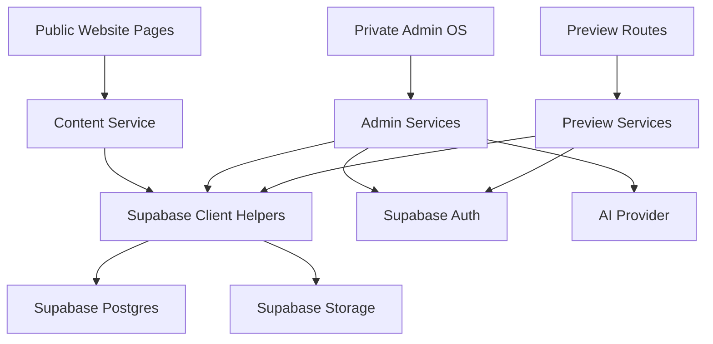

# SAUMYA.OS Technical Design Document

This is the canonical Technical Design Document for the personal portfolio CMS and Admin OS.
Every completed phase must update this document before the next phase begins.

## 1. Executive Summary

SAUMYA.OS is a single-user, AI-assisted portfolio publishing system for an engineering-focused personal website. The public website remains a polished, stable portfolio experience. The private Admin OS becomes the controlled workspace for creating drafts, reviewing AI suggestions, managing media, previewing content in the production layout, publishing changes, and rolling back mistakes.

The core architectural boundary is:

```txt
Pages
  -> Content Service
  -> Supabase
  -> Database / Storage
```

Public pages must never query Supabase directly. They consume reusable content service functions. Supabase access is isolated in service/repository/client helpers so the website UI remains decoupled from the backend implementation.

## 2. Project Goals

- Preserve the public website UI and SEO while moving content into a structured backend.
- Build a private Admin OS for a single owner, not a generalized CMS product.
- Support Projects, Hero, About, Timeline, Photography, Research, Resume, Skills, Site Settings, Media, and SEO.
- Enforce a safe publishing workflow: Draft -> Review -> Preview -> Approve -> Deploy -> Published.
- Allow AI to assist with writing, summaries, SEO, slugs, tags, alt text, media organization, and case-study structure.
- Prevent AI from directly editing or publishing live content.
- Maintain version history, rollback, activity logs, and scheduled publishing.
- Keep the architecture modular enough to evolve without redesigning the public website.

## 3. Non-Goals

This project is not:

- A multi-user CMS
- A blogging platform
- A SaaS product
- A website builder
- A generic portfolio template
- A marketplace or community publishing tool
- A no-code editor for arbitrary websites

This project is:

- A single-user AI-assisted engineering portfolio
- A private Admin Operating System
- A structured publishing platform
- A long-term personal knowledge base
- A controlled content pipeline for one public personal website

## 4. Tech Stack

Runtime and framework:

- Next.js 14 App Router
- React 18
- TypeScript
- Tailwind CSS

Backend and data:

- Supabase Postgres
- Supabase Auth
- Supabase Storage
- Supabase Row Level Security
- `@supabase/supabase-js`
- `@supabase/ssr`

Content and infrastructure:

- Content Service layer in `lib/content`
- Supabase helper clients in `lib/supabase`
- SQL migrations in `supabase/migrations`
- Migration scripts in `scripts`
- Vercel-compatible deployment target

AI:

- AI provider is intentionally not hardcoded yet.
- The architecture assumes a server-side AI service layer that writes to `ai_drafts` and `ai_generation_history`.
- AI output is always treated as draft content until manually accepted.

## 5. Folder Structure

Current important structure:

```txt
app/
  page.tsx
  layout.tsx
  projects/[id]/page.tsx
  personal/
  archive/
  contact/
  logbook/

components/
  home/
  layout/
  personal/
  projects/
  ui/

content/
  projects/generated/

data/
  photos.ts
  logbook/

lib/
  content.ts
  types.ts
  supabase/
    admin.ts
    browser.ts
    server.ts

scripts/
  supabase-projects-migrate.ts

supabase/
  migrations/
    001_personal_portfolio_cms.sql

SYSTEM_ARCHITECTURE.md
middleware.ts
```

Target structure for future phases:

```txt
app/
  (public)/
    page.tsx
    projects/
    personal/
    archive/
    contact/
    logbook/
  admin/
    layout.tsx
    page.tsx
    projects/
    media/
    ai/
    settings/
  preview/
    projects/
    pages/
    research/

lib/
  content/
    public/
    preview/
    admin/
    repositories/
    mappers/
    cache/
    types/
  supabase/
    admin.ts
    browser.ts
    server.ts
```

The current implementation may evolve toward this structure gradually. Public UI should not be redesigned during folder migration.

## 6. Overall System Architecture



The public website is read-focused and only consumes published content. The Admin OS is write-focused and requires authentication. Preview routes are authenticated read routes that can render draft or scheduled content in the production layout.

## 7. Public Website Architecture

Public pages:

- Render through Next.js server components.
- Call content service functions such as `getProjects()`, `getProject(slug)`, `getTimelineEvents()`, and `getSkills()`.
- Receive frontend-safe models shaped like the existing JSON content.
- Must not import Supabase clients.
- Must not know whether content came from JSON, Supabase, cache, or another future backend.

Current public architecture:

```txt
app/page.tsx
  -> lib/content.ts
  -> lib/supabase/server.ts
  -> Supabase

app/projects/[id]/page.tsx
  -> lib/content.ts
  -> lib/supabase/server.ts
  -> Supabase
```

Public rendering rules:

- Only published content is visible.
- Public routes should tolerate missing optional content.
- Required missing content should result in a not-found state.
- UI classes, layout, and visual behavior should remain stable during backend migration.

## 8. Admin OS Architecture

The Admin OS is a private control surface for one owner.

Planned Admin OS areas:

- Dashboard
- Projects
- Pages / Hero / About
- Timeline
- Photography
- Research
- Resume
- Skills
- Media Library
- AI Drafts
- Publishing Queue
- Version History
- Activity Log
- Settings

Admin OS principles:

- Authentication is required before reading or writing private content.
- Admin pages may use browser Supabase client only for authenticated admin UI needs.
- Mutations should prefer Server Actions.
- API routes are allowed for upload handlers, AI generation, scheduled jobs, preview toggles, and external callbacks.
- Every content mutation should create an activity log entry.
- Every publishable content mutation should create a version snapshot.

No authentication UI or Admin OS UI is implemented in this phase.

## 9. Database Architecture

The approved schema is defined in:

```txt
supabase/migrations/001_personal_portfolio_cms.sql
```

The schema is designed for a single-user AI-assisted portfolio CMS, not a multi-tenant enterprise CMS.

Core table groups:

- Global settings: `site_settings`, `admin_profile`
- Public content: `pages`, `page_sections`, `projects`, `timeline_events`, `skills`, `photo_spreads`, `research_entries`, `archive_items`, `resume_versions`
- Relationships: `project_media`, `project_skills`, `project_taxonomy_terms`, `project_relationships`, `photo_spread_items`, `research_entry_projects`, `research_entry_media`, `archive_item_media`
- Metadata: `taxonomy_terms`, `seo_metadata`, `media_assets`
- AI operations: `ai_drafts`, `ai_generation_history`
- Publishing operations: `scheduled_publishing`
- Safety and audit: `content_versions`, `rollback_events`, `activity_log`

Database requirements supported:

- Draft support
- Published state
- Ordering
- Featured items
- SEO fields
- Image metadata
- File relationships
- Version history
- Rollback support
- Activity logging
- Scheduled publishing
- Single-admin authentication model

No schema changes should happen after the schema freeze unless a future phase discovers a blocking requirement.

## 10. Content Service Architecture

The Content Service is the boundary between UI and backend data.

Current service:

```txt
lib/content.ts
```

Current Supabase helpers:

```txt
lib/supabase/server.ts
lib/supabase/browser.ts
lib/supabase/admin.ts
```

Service responsibilities:

- Fetch published content for public routes.
- Shape database rows into stable frontend models.
- Preserve existing public UI behavior.
- Hide Supabase query details from pages and components.
- Provide the future seam for preview/admin reads without coupling UI to database tables.

Current public service functions:

- `getProjects()`
- `getProject(id)`
- `getTimelineEvents()`
- `getSkills()`

Planned service groups:

- Public content services
- Preview services
- Admin services
- Repository/query modules
- Mapper modules
- Cache helpers

Public pages must continue to call services, not Supabase.

## 11. API Architecture And Contract

Public routes should normally call content service functions directly. API routes are reserved for admin workflows, preview toggles, uploads, scheduled jobs, and AI operations.

API principles:

- Public website pages must not query Supabase directly.
- Public website pages should use server-side content service functions, not public API fetches, for normal rendering.
- API routes are reserved for admin workflows, preview toggles, uploads, scheduled jobs, and AI operations.
- Every admin mutation must authenticate the single admin user.
- Every mutation that changes content should create an activity log entry.
- Every mutation that changes publishable content should create a version snapshot.
- Public reads must return only published content.
- Preview reads may return draft and scheduled content after authentication.
- Route handlers should return stable JSON envelopes so the Admin OS can handle errors consistently.

### Response Envelope

Successful responses:

```ts
interface ApiSuccess<T> {
  ok: true
  data: T
  meta?: {
    requestId?: string
    cacheTag?: string
  }
}
```

Error responses:

```ts
interface ApiError {
  ok: false
  error: {
    code:
      | "UNAUTHORIZED"
      | "FORBIDDEN"
      | "NOT_FOUND"
      | "VALIDATION_ERROR"
      | "CONFLICT"
      | "DATABASE_ERROR"
      | "STORAGE_ERROR"
      | "AI_ERROR"
      | "UNKNOWN_ERROR"
    message: string
    fieldErrors?: Record<string, string[]>
  }
}
```

### Public Content Contract

#### `GET /projects`

Returns published project summaries.

Query params:

```ts
interface ProjectsQuery {
  domain?: string
  technology?: string
  featuredOnly?: boolean
  limit?: number
}
```

Response:

```ts
type ProjectsResponse = ApiSuccess<ProjectSummary[]>
```

#### `GET /projects/:slug`

Returns one published project detail.

Response:

```ts
type ProjectResponse = ApiSuccess<ProjectDetail>
```

Errors:

- `NOT_FOUND` when the project does not exist or is not published.

#### `GET /timeline`

Returns published timeline events.

Response:

```ts
type TimelineResponse = ApiSuccess<TimelineEvent[]>
```

#### `GET /skills`

Returns the published skill graph used by the home page.

Response:

```ts
type SkillsResponse = ApiSuccess<SkillNode[]>
```

#### `GET /research`

Returns published research/logbook entries.

Query params:

```ts
interface ResearchQuery {
  category?: string
  projectSlug?: string
  limit?: number
}
```

Response:

```ts
type ResearchResponse = ApiSuccess<ResearchEntrySummary[]>
```

#### `GET /research/:slug`

Returns a published research/logbook entry.

Response:

```ts
type ResearchEntryResponse = ApiSuccess<ResearchEntryDetail>
```

#### `GET /photography`

Returns published photo spreads and ordered spread items.

Response:

```ts
type PhotographyResponse = ApiSuccess<PhotoSpread[]>
```

#### `GET /site-settings`

Returns public site settings.

Response:

```ts
type SiteSettingsResponse = ApiSuccess<SiteSettings>
```

### Preview Contract

Preview routes require an authenticated admin session or signed preview token.

#### `GET /preview/projects/:slug`

Returns draft, scheduled, or published project content.

Response:

```ts
type PreviewProjectResponse = ApiSuccess<ProjectDetail>
```

Errors:

- `UNAUTHORIZED` when no valid preview/admin session exists.
- `NOT_FOUND` when the target does not exist.

#### `GET /preview/pages/:slug`

Returns draft, scheduled, or published page content.

Response:

```ts
type PreviewPageResponse = ApiSuccess<PageContent>
```

### Draft Contract

Draft endpoints are admin-only and should be implemented as Server Actions where possible. API route equivalents are listed for contract clarity.

#### `POST /drafts/project`

Creates a project draft.

Request:

```ts
interface CreateProjectDraftRequest {
  title: string
  slug?: string
  description?: string
  domain?: string
  source?: "manual" | "ai" | "import"
  content?: Partial<ProjectDraftInput>
}
```

Response:

```ts
type CreateProjectDraftResponse = ApiSuccess<ProjectDetail>
```

Side effects:

- Creates `content_versions` snapshot.
- Creates `activity_log` entry.

#### `PATCH /drafts/project/:id`

Updates an existing project draft.

Request:

```ts
interface UpdateProjectDraftRequest {
  patch: Partial<ProjectDraftInput>
  changeSummary?: string
}
```

Response:

```ts
type UpdateProjectDraftResponse = ApiSuccess<ProjectDetail>
```

Side effects:

- Creates `content_versions` snapshot.
- Creates `activity_log` entry.

#### `POST /publish/project/:id`

Publishes a project immediately.

Request:

```ts
interface PublishProjectRequest {
  changeSummary?: string
}
```

Response:

```ts
interface PublishResult {
  target: ContentTarget
  status: "published"
  publishedAt: string
  revalidatedTags: string[]
}
```

Side effects:

- Sets status to `published`.
- Sets `published_at`.
- Creates version snapshot.
- Creates activity log entry.
- Revalidates project, project list, timeline, skills, and SEO cache tags.

#### `POST /schedule/project/:id`

Schedules a project publish action.

Request:

```ts
interface ScheduleProjectRequest {
  action: "publish" | "unpublish" | "archive"
  scheduledFor: string
}
```

Response:

```ts
type ScheduleProjectResponse = ApiSuccess<ScheduledPublishJob>
```

### Media Contract

#### `GET /media`

Lists media library assets for the Admin OS.

Query params:

```ts
interface MediaQuery {
  mediaType?: string
  bucket?: string
  search?: string
  limit?: number
  cursor?: string
}
```

Response:

```ts
type MediaResponse = ApiSuccess<{
  items: MediaAsset[]
  nextCursor?: string
}>
```

#### `POST /media/upload`

Uploads media and creates a `media_assets` row.

Request:

```ts
interface MediaUploadRequest {
  bucket: string
  path?: string
  fileName: string
  mimeType: string
  mediaType: string
  altText?: string
  caption?: string
  metadata?: Record<string, unknown>
}
```

Response:

```ts
type MediaUploadResponse = ApiSuccess<MediaAsset>
```

Side effects:

- Uploads file to Supabase Storage.
- Creates `media_assets` row.
- Creates activity log entry.

### AI Contract

#### `POST /ai/generate`

Generates an AI draft or content suggestion.

Request:

```ts
interface AiGenerateRequest {
  targetType: ContentTargetType
  targetId?: string
  operation:
    | "create"
    | "rewrite"
    | "summarize"
    | "seo"
    | "tag"
    | "expand"
    | "condense"
  prompt: string
  context?: Record<string, unknown>
}
```

Response:

```ts
type AiGenerateResponse = ApiSuccess<AiDraft>
```

Side effects:

- Creates `ai_drafts` row.
- Creates `ai_generation_history` row.
- Creates activity log entry.

#### `POST /ai/drafts/:id/accept`

Accepts an AI draft into a real content target.

Response:

```ts
type AcceptAiDraftResponse = ApiSuccess<ContentTarget>
```

Side effects:

- Updates target content.
- Marks AI draft as accepted.
- Creates content version snapshot.
- Creates activity log entry.

#### `POST /ai/drafts/:id/reject`

Rejects an AI draft.

Response:

```ts
type RejectAiDraftResponse = ApiSuccess<{ id: string; status: "rejected" }>
```

### Version And Rollback Contract

#### `GET /versions`

Lists version history for a target.

Query params:

```ts
interface VersionsQuery {
  targetType: ContentTargetType
  targetId: string
}
```

Response:

```ts
type VersionsResponse = ApiSuccess<ContentVersion[]>
```

#### `POST /versions/:id/rollback`

Restores a previous version.

Request:

```ts
interface RollbackRequest {
  reason?: string
}
```

Response:

```ts
type RollbackResponse = ApiSuccess<RollbackResult>
```

Side effects:

- Restores target from `content_versions.snapshot_json`.
- Creates a new content version with `change_source = "rollback"`.
- Creates `rollback_events` row.
- Creates activity log entry.
- Revalidates affected cache tags if the target is public.

### Activity Contract

#### `GET /activity`

Lists admin activity events.

Query params:

```ts
interface ActivityQuery {
  targetType?: ContentTargetType
  targetId?: string
  action?: string
  limit?: number
  cursor?: string
}
```

Response:

```ts
type ActivityResponse = ApiSuccess<{
  items: ActivityLogEntry[]
  nextCursor?: string
}>
```

### Authentication Contract

#### `GET /auth/me`

Returns the current authenticated admin profile.

Response:

```ts
type AuthMeResponse = ApiSuccess<AdminProfile>
```

Errors:

- `UNAUTHORIZED` when no valid session exists.
- `FORBIDDEN` when the authenticated Supabase user is not present in `admin_profile`.

### Scheduled Publishing Contract

#### `POST /publishing/run-scheduled`

Runs pending scheduled publishing jobs.

Authentication:

- Requires server-side secret or trusted scheduled job environment.

Response:

```ts
type RunScheduledPublishingResponse = ApiSuccess<{
  completed: number
  failed: number
  jobIds: string[]
}>
```

Side effects:

- Executes pending jobs whose `scheduled_for <= now`.
- Updates job status.
- Creates activity log entries.
- Revalidates affected cache tags.

### Core Type Contract

```ts
type PublishStatus = "draft" | "published" | "archived"

type ContentTargetType =
  | "site_settings"
  | "page"
  | "page_section"
  | "project"
  | "research_entry"
  | "photo_spread"
  | "archive_item"
  | "media_asset"
  | "seo_metadata"

interface ContentTarget {
  type: ContentTargetType
  id: string
}

interface ProjectSummary {
  id: string
  slug: string
  title: string
  description: string
  year: number
  domain: string
  statusLabel: string
  complexityScore?: string
  technologies: string[]
  featured: boolean
  heroImage?: MediaAsset
}

interface ProjectDetail extends ProjectSummary {
  overview?: string
  problem?: string
  solution?: string
  architecture?: string
  implementation?: string
  challenges?: string
  outcomes?: string
  lessonsLearned: string[]
  currentStatus?: string
  futureImprovements?: string
  metrics: Array<{ label: string; value: string; unit?: string }>
  links: Array<{ label: string; url: string; type: string }>
  hardwareComponents: string[]
  softwareComponents: string[]
  engineeringConcepts: string[]
  researchAreas: string[]
  gallery: MediaAsset[]
  relatedProjects: ProjectSummary[]
  seo?: SeoMetadata
}

interface MediaAsset {
  id: string
  bucket: string
  path: string
  publicUrl: string
  fileName: string
  mimeType?: string
  mediaType: string
  altText?: string
  caption?: string
  width?: number
  height?: number
  blurhash?: string
}
```

## 12. Authentication Strategy

Authentication will use Supabase Auth.

Rules:

- There is one allowed admin identity.
- Public pages require no session.
- Admin routes require a valid Supabase session.
- Registration is not exposed in the app.
- Middleware refreshes sessions using `@supabase/ssr`.
- Admin authorization is verified against `admin_profile`.
- Authentication UI is intentionally not implemented yet.

Current status:

- Supabase SSR middleware exists for session refresh.
- Reusable Supabase server, browser, and admin clients exist.
- Admin login UI and route protection remain pending.

## 13. Authorization Strategy

Authorization uses two layers:

1. Application-level checks in admin services and route handlers.
2. Database-level Row Level Security policies in Supabase.

Public access:

- Can read published public content.
- Cannot read drafts.
- Cannot write.

Preview access:

- Requires authenticated admin.
- Can read draft, scheduled, and published content.
- Cannot mutate unless using admin services.

Admin access:

- Requires authenticated user present in `admin_profile`.
- Can create, update, publish, schedule, archive, upload media, accept AI drafts, and roll back content.
- Every mutation should create activity and version records.

Service-role access:

- Reserved for trusted scripts and scheduled jobs only.
- Must never be exposed to browser code.

## 14. AI Integration Strategy

AI assists the owner but never controls publishing.

Allowed AI responsibilities:

- Generate drafts
- Rewrite text
- Improve grammar
- Summarize content
- Generate SEO suggestions
- Suggest slugs
- Suggest tags
- Suggest alt text
- Organize media
- Suggest layouts
- Suggest typography direction
- Build project case-study drafts

AI restrictions:

- AI cannot directly edit published content.
- AI cannot publish.
- AI suggestions require manual approval.
- AI outputs are stored as drafts.
- AI generation history is retained for auditability.

Database support:

- `ai_drafts`
- `ai_generation_history`
- `activity_log`
- `content_versions`

Provider strategy:

- AI provider is selected later.
- Provider access must be server-side only.
- Prompts, inputs, outputs, model names, token usage, and acceptance status should be recorded.

## 15. Media Storage Strategy

Media is stored in Supabase Storage and tracked in `media_assets`.

Storage buckets:

- `images`
- `project-media`
- `photography`
- `documents`
- `datasets`
- `dashboards`
- `audio`
- `archives`
- `seo`

Media requirements:

- Store metadata such as filename, MIME type, media type, dimensions, captions, alt text, credit, file size, and dominant color when available.
- Keep media reusable across projects, pages, photography, research, archive items, SEO, and resume versions.
- Future media library should support upload, preview, search, folders, deletion, duplicate detection, compression, responsive images, thumbnails, and metadata editing.

## 16. Deployment Strategy

Target deployment:

- Public website: `saumya.space`
- Private Admin OS: `admin.saumya.space` or `/admin`

Deployment requirements:

- HTTPS
- Production Supabase project
- Supabase environment variables configured in deployment provider
- Middleware enabled for session refresh
- Image optimization
- SEO metadata preserved
- Scheduled publishing job configured
- Production migration process documented
- Database backups and rollback plan established

Deployment should not change public UI without explicit approval.

## 17. Environment Variables

Required public/server variables:

```txt
NEXT_PUBLIC_SUPABASE_URL
NEXT_PUBLIC_SUPABASE_ANON_KEY
```

Required server-only variables:

```txt
SUPABASE_URL
SUPABASE_SERVICE_ROLE_KEY
```

Future variables:

```txt
ADMIN_ALLOWED_EMAIL
AI_PROVIDER_API_KEY
AI_PROVIDER_MODEL
SCHEDULED_PUBLISH_SECRET
NEXT_PUBLIC_SITE_URL
```

Rules:

- `NEXT_PUBLIC_*` variables may be exposed to browser code.
- Service role keys must never be exposed to browser code.
- AI provider keys must remain server-side only.
- Production and local variables should be kept separate.
- Placeholder values are not valid configuration.

## 18. Security Model

Security controls:

- Supabase Auth for admin identity.
- Supabase RLS for database access.
- Middleware session refresh.
- Service-role client restricted to trusted scripts/jobs.
- Admin-only route and service boundaries.
- No public direct database writes.
- Public services filter to published content.
- Preview services require auth.
- Activity logging for admin actions.
- Version snapshots for content changes.
- Manual approval required before publish.

Threats considered:

- Draft leakage to public routes
- Service role key exposure
- Unauthorized admin route access
- AI-generated content publishing without review
- Accidental destructive edits
- Media deletion or metadata corruption
- Broken SEO caused by backend migration

Security principle:

The public website should remain readable without authentication, but every write path must be authenticated, authorized, logged, and recoverable.

## 19. Caching Strategy

Public reads should be cacheable by content type and invalidated on publish.

Suggested cache tags:

- `site-settings`
- `pages`
- `page:{slug}`
- `projects`
- `project:{slug}`
- `timeline`
- `skills`
- `research`
- `research:{slug}`
- `photography`
- `archive`
- `media`
- `seo:{ownerType}:{ownerId}`

Admin and preview reads:

- Should avoid persistent public cache.
- May use request-level memoization.
- Must always respect authentication state.

Mutation invalidation:

- Publishing a project invalidates project detail, project list, timeline, skills, and SEO.
- Publishing a page invalidates that page and relevant site settings/SEO tags.
- Publishing photography invalidates photography.
- Publishing research invalidates research list, research detail, and linked project contexts.
- Media changes invalidate owners using that media.

## 20. Draft -> Review -> Preview -> Deploy Workflow

Global editorial workflow:

```txt
Generate
  -> Draft
  -> Review
  -> Preview
  -> Edit
  -> Approve
  -> Deploy
  -> Published
```

Content states:

- Draft
- Review
- Scheduled
- Published
- Archived

Rules:

- Nothing reaches the live website without explicit approval.
- AI output starts as draft content.
- Preview uses the production layout.
- Publish is always manual unless a scheduled publish job was manually created.
- Version history and rollback support are required for every published item.

## 21. Version History Strategy

Version history is stored in `content_versions`.

Version rules:

- Every meaningful content mutation creates a snapshot.
- Snapshots include target type, target ID, version number, serialized content, change source, change summary, creator, and timestamp.
- AI-accepted changes should record `change_source = "ai"`.
- Manual edits should record `change_source = "manual"`.
- Scheduled publishes should record `change_source = "scheduled_publish"`.
- Rollbacks should record `change_source = "rollback"`.

Purpose:

- Audit content evolution.
- Compare versions.
- Restore previous states.
- Reduce risk during AI-assisted editing.

## 22. Rollback Strategy

Rollback uses `content_versions` and `rollback_events`.

Rollback flow:

```txt
Select previous version
  -> Validate admin access
  -> Restore snapshot
  -> Create new rollback version
  -> Record rollback event
  -> Record activity log
  -> Revalidate affected public cache
```

Rollback rules:

- Rollback never deletes history.
- Rollback creates a new current version from an old snapshot.
- Rollback reason should be optional but encouraged.
- Public cache must be invalidated when rolling back published content.

## 23. Future Scalability

The system should scale in capability without becoming a generic CMS.

Allowed future expansion:

- More content modules
- Richer project case-study blocks
- Better media processing
- AI-assisted editorial workflows
- Search across personal knowledge base
- Structured datasets and research archive
- Admin analytics
- Scheduled publishing
- Preview links
- Content diffing

Scalability boundaries:

- Keep single-user assumptions.
- Avoid multi-tenant abstractions.
- Avoid generalized page-builder complexity.
- Prefer JSON for small collections that do not need independent querying.
- Normalize media, SEO, publishing state, versions, and activity logs.
- Keep public UI decoupled from backend details.

## 24. Development Rules

Before writing code:

1. Explain implementation plan.
2. List files to modify.
3. List risks.
4. Request approval for major architectural changes.

Never:

- Skip phases.
- Invent functionality outside the roadmap.
- Break existing pages.
- Auto-publish content.
- Redesign unrelated components.
- Query Supabase directly from public pages.
- Expose service-role or AI provider keys to the browser.
- Modify the database schema after freeze unless absolutely necessary.

Always:

- Preserve public UI unless the task explicitly requests design work.
- Maintain the Content Service boundary.
- Keep implementation modular.
- Log admin mutations.
- Create version snapshots for content changes.
- Verify TypeScript after code changes.
- Update this document when a phase is completed.

## 25. Coding Standards

TypeScript:

- Use strict TypeScript.
- Prefer explicit interfaces for service boundaries.
- Keep database row types separate from frontend models.
- Use mapper functions between database rows and UI models.
- Avoid `any`; use `unknown` and narrow when needed.

Next.js:

- Public server pages call content services.
- Admin mutations prefer Server Actions.
- API routes are reserved for external/system-triggered workflows.
- Middleware handles session refresh only until admin route protection is implemented.

Supabase:

- Use official `@supabase/supabase-js` and `@supabase/ssr`.
- Use browser client only where client-side authenticated admin behavior is required.
- Use server client for server-side reads and authenticated server actions.
- Use service-role admin client only in trusted scripts and server jobs.

CSS/UI:

- Do not modify public UI during backend phases.
- Admin OS should be minimal, monochrome, premium, and operational.
- Avoid unrelated redesigns.

Documentation:

- Every phase completion updates this document.
- Major decisions should be recorded here before implementation.

## 26. Phase Checklist

| Phase | Status | Completion Standard |
| --- | --- | --- |
| Phase 0 - Technical Design Document | Complete | This document defines goals, non-goals, architecture, security, workflows, stack, environment, standards, and phase plan. |
| Phase 1 - Architecture | Pending | Public/admin routing prepared, hardcoded content identified, migration report produced, UI and SEO unchanged. |
| Phase 2 - Database Migration | In Progress | Schema and migration files exist. Remote Supabase execution and full content migration verification are still required. |
| Phase 2.5 - Content Model Review | Complete | Schema reviewed and frozen for single-user AI-assisted portfolio CMS. |
| Phase 3 - Authentication | Pending | Supabase Auth, one allowed email, middleware protection, and unauthorized blocking completed. |
| Phase 3.5 - Content Service Layer | In Progress | Public project service uses Supabase through content service. Remaining content types still need service coverage. |
| Phase 4 - Admin OS Shell | Pending | Sidebar, terminal/workspace shell, notifications, settings shell created without editing features. |
| Phase 5 - AI Draft Workflow | Pending | AI draft, preview, manual edit, approve, publish, version, rollback workflow implemented. |
| Phase 6 - Media Library | Pending | Upload, preview, search, folders, metadata, thumbnails, compression, duplicate detection implemented. |
| Phase 7 - AI Assistant | Pending | AI suggestions implemented with manual approval only. |
| Phase 8 - Content Modules | Pending | Projects, Hero, Timeline, Photography, Research, Resume, Skills, About, Settings support CRUD, preview, publish, archive. |
| Phase 9 - Deployment | Pending | Public/private deployment, HTTPS, auth, image optimization, SEO, performance, deployment checklist completed. |

Phase progression rule:

- Do not continue to the next implementation phase until the current phase is reviewed and approved.
- If a phase is partially complete, finish and verify the missing items before marking it complete.
